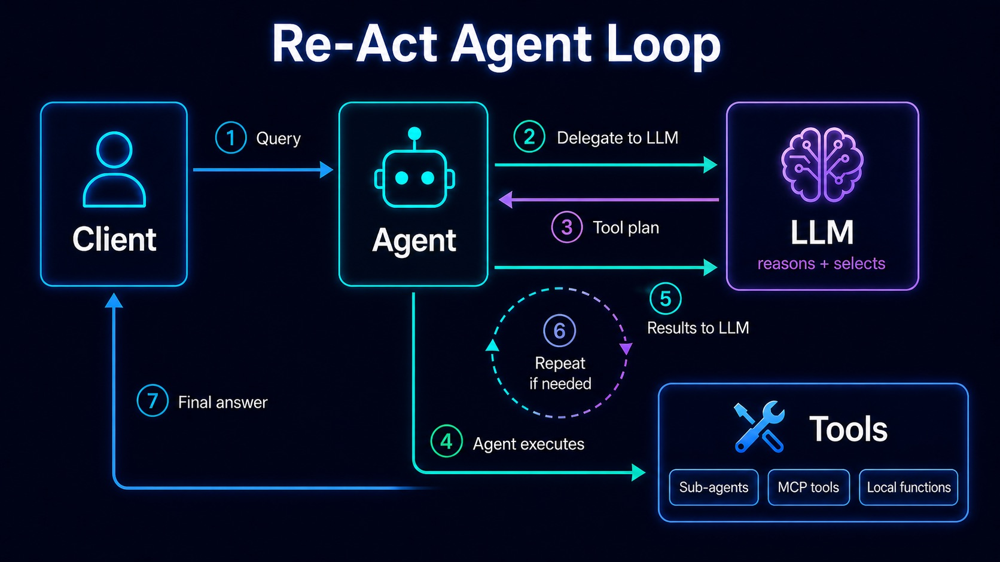

# http4k A2A (Agent2Agent Protocol)

This example demonstrates how to build and test an A2A agent using http4k.

## Learnings

- The Agent itself should be "dumb", i.e. not actually executing capabilities
  - Skills are not explicitly invoked, so it's not easy to understand in code how we would handle a given request
  - Message will be delegated to an LLM for processing
  - The agent provides the LLMs also all the available tools definitions
  - LLMs will then interpret the intent and decide whether an MCP capability, e.g. tool, needs to be invoked
  - Once the LLM decides is the agent which will invoke the MCP capability
  - The business logic lives on the MCP side, not the Agent side
  - Once the result are available it will delegate once again to the LLMs in order to get a final answer

- The Re-Act pattern, Reasoning and Acting
  - refine the result out of the process above until a final answer is achieved

- Agent responses are typically streamed

- The pattern is typically Agent orchestrator + Sub-agents for different domains/boundary
  - sub-agents are considered also tools
  - sub-agents cards are sent to the LLM for decision making together with MCP tools

- Http4k friction
  - Same class names across different (bounded) "contexts", so there are few translations, back and forth
  - The Chat, i.e. LLM abstraction, is loosely coupled with Model selection, e.g. allowing an Anthropic Model to be selected for a OpenAI LLM
    - I had to introduce a `FixedModelChat` abstraction to fix that, and provide a `ModelName.inherited()` extension to support that
  - Need to understand how I can instantiate A2A clients that support in-memory calls, or maybe everything should be simplified back to a function tool it needs to run independently
  - Some of the abstractions weren't advertised well, e.g. LLMTools, so it took a while before being able to simplify things out
